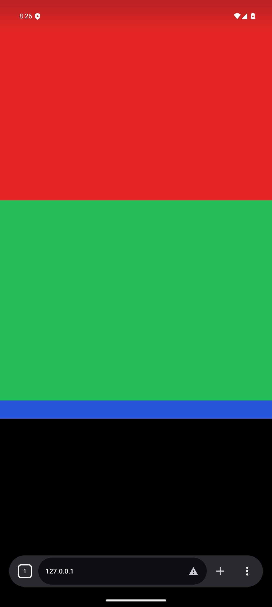
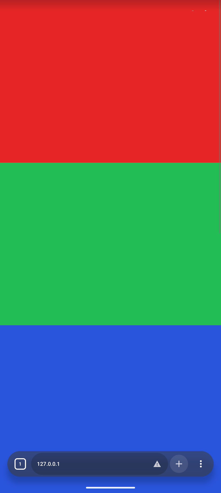

# Dark appearance and address-tab handoff

## Scope and reproduction

| Report | Controlled environment | Observation |
| --- | --- | --- |
| Light Candy logo backing and tab-switch suggestion under System dark | API 35, System dark, Dynamic palette; explicit Dark and AMOLED; regular/private tabs | Accent and inverse Material roles can remain bright within a dark scheme |
| Keyboard-sized black area after New tab → address input → switch to an existing tab | API 35, 1080 × 2410, density 356; real IME and suggestion click | Android view bounds and JavaScript viewport recover, but the native SurfaceView buffer retains the keyboard-sized crop |
| Same simple handoff on the reported Android generation | API 37, regular, immersive and Frosted variants | Baseline passes; the physical-device variant has not been independently reproduced |
| Google remains light under System dark | Fresh Gecko profile, first Google search, regular tab | Page reports native `prefers-color-scheme: dark` while Google's initial search-result styles remain light; reloading renders Google's native dark styles |

The physical Pixel was inspected read-only. Its auto-rotation setting was not changed. Each
agent used a dedicated emulator and explicit ADB serial. The original navigation issue #221
was already merged separately; this audit concerns the subsequent appearance/viewport report.

| API 35 baseline: black crop after suggestion click | API 35 handoff candidate: restored full page |
| --- | --- |
|  |  |

The synthetic page uses three authored color bands. Assertions also compare native bounds,
surface frame size and JavaScript visual-viewport dimensions, density and scale.

## Changes and ownership

| Concern | Change | Owner |
| --- | --- | --- |
| New-tab/editor surfaces | Use neutral dark Material surfaces for dark logo backing and private-mode contrast; preserve multicolor logo artwork and existing light treatment | `BlankTabColorRules`, `NewTabPage`, `AddressEditorBackdrop` |
| Open-tab suggestion | Use dark neutral containers with `onSurface` content; preserve separate switch and fill actions | `AddressSuggestionColorRules`, `NavigationSuggestionRow` |
| Native website preference | Resolve persisted System appearance from effective Activity resources to concrete Light/Dark; reapply at start/resume | `BrowserWebContentAppearanceRules`, `BrowserController` |
| IME-to-tab handoff | Close the editor and wait for the observed zero IME inset plus the next frame before binding an existing Gecko session; cancel stale selections and Back | `BrowserImeHandoff`, `BrowserScreen` |

## Causal checks

| Experiment | Result | Interpretation |
| --- | --- | --- |
| Deliberately stale Gecko night configuration while Activity remains current | Baseline returns the wrong native CSS theme; fixed preference remains correct without another page request | Concrete website preference removes dependence on Gecko's separate native night cache |
| First inline script on a genuine cold `ACTION_VIEW` navigation | Baseline and fixed both start dark, zero media-query changes, one page request | Controlled cold start does not reproduce an initial light-to-dark preference race |
| Remove Gecko's additional root keyboard listener | API 35 black crop remains | Rejected as a fix; production listener removal was not retained |
| Force `SOFT_INPUT_ADJUST_NOTHING` during the same real suggestion flow | API 35 black crop remains | A window-mode change alone did not establish a fix |
| Close editor and wait for real IME disappearance before binding the old tab | Three API 35 cycles restore geometry, scale and visible page pixels | Session-binding timing at the IME handoff is the demonstrated trigger |
| Disable default uBlock Origin and I Don't Care About Cookies | First Google result stays light; dismissing consent causes no new main-frame request | Default add-ons do not explain the initial light result in this reproduction |
| Experimental native `Sec-CH-Prefers-Color-Scheme: "dark"` header | Header confirmed after request mutations; first Google result still light | Ineffective experiment; all temporary header and tracing source changes removed |
| Select Google's own native dark-design option | Search results render dark and Google's menu reports dark design enabled | Google's authored dark theme works independently of Candy recoloring |

The immutable cold-start fixture records the first media-query result before the body parses.
Its title never changes; a separate counter records later events. It cannot hide an initially
light document by waiting for a later dark update. One baseline launch hit a Gecko native
`WebExtension.Port` shutdown `NullHandle` crash before the fixture loaded; a fresh retry passed.
That launch is recorded separately and is not evidence of an initial theme mismatch.

## Google boundary

Google's own dark search theme exists. The reproduced first-load behavior persists when native
dark preference is already correct. Official Firefox 157.0 on the same dedicated API 35
emulator, with fresh application data and System dark, reproduces the same light first result
and dark result after one genuine reload. Its Google menu also shows device-default theme.
This comparison establishes that Candy's request pipeline and add-ons are not required for
the symptom; it does not identify Google's internal implementation cause.

| Browser, fresh profile | First Google search | After one real reload |
| --- | --- | --- |
| Candy baseline | Light | Dark |
| Candy candidate | Light, native dark preference confirmed | Dark |
| Official Firefox 157.0 | Light | Dark |

The Firefox control used Mozilla's
[official arm64 APK](https://archive.mozilla.org/pub/fenix/releases/157.0/android/fenix-157.0-android-arm64-v8a/fenix-157.0.multi.android-arm64-v8a.apk),
version code `2016186458`, SHA-256
`04cc6dc327019a02283647907baf79e507c74f61760446dd60fb817cf7a4d436`.
Mozilla's [site-compatibility report 1934090](https://bugzilla.mozilla.org/show_bug.cgi?id=1934090)
also documents initial light results followed by native dark results after reload, including
Chrome. This is supporting upstream evidence, not proof that every reported device variant has
the same cause. Candy does not inject a forced dark stylesheet, overwrite Google cookies or
silently reload a completed search to conceal the result.

## Verification

| Check | Result |
| --- | --- |
| Final Full/Foss JVM suites | 1,717 tests each; zero failures, errors or skips |
| Final Full/Foss debug assembly and lint | Pass; lint uses legacy UAST because the repository's default K2 path has an existing internal FIR failure |
| Dark UI tests plus existing suggestion/new-tab suites, API 35 | 17/17 pass |
| Gecko appearance suite, normal candidate APK, API 35 | 5/5 pass; 55.196 seconds |
| Isolated immutable cold-start fixture, API 35 | Baseline 1/1 and fixed 1/1 pass; both first dark, zero changes, no reload |
| Isolated immutable cold-start fixture, normal candidate APK, API 35 | 1/1 pass; 5.216 seconds; first dark, zero changes, no reload |
| Final tab-switch and website-input keyboard suites, API 35 | 6/6 pass; 41.674 seconds; real normal/immersive/Frosted suggestion cases each repeat three IME cycles |
| Final tab-switch and website-input keyboard suites, API 37 | 6/6 pass; 44.075 seconds; same real user flows and native/DOM/pixel assertions |
| Final independent code review | No remaining blockers after adding new-editor, settings/overview and same-ID private-mode cancellation guards |
| Normal APK experiment cleanup | Performance diagnostics disabled; installed Candy Privacy Host 1.5.60 active; no temporary Google hint/trace code |

The final build command was:

```sh
./gradlew testFullDebugUnitTest testFossDebugUnitTest assembleFullDebug assembleFossDebug \
  assembleFullDebugAndroidTest lintFullDebug lintFossDebug -Dlint.useK2Uast=false --console=plain
```

Device methods were invoked with the explicit agent-owned serial. The appearance/cold-start
checks ran on `emulator-5614`; the viewport/input suites ran sequentially on `emulator-5616`
with separate API 35 and API 37 AVDs. The earlier UI suite used `emulator-5612`.
Final debug builds leave `ENABLE_PERFORMANCE_DIAGNOSTICS=false` for both flavors.
