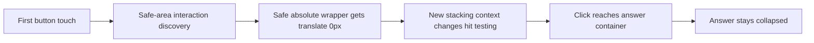

# Google AI Overview first-tap investigation

## Source and scope

| Item | Evidence |
| --- | --- |
| Report | [Issue 209](https://github.com/sk2andy/candy-browser/issues/209), split from [issue 204](https://github.com/sk2andy/candy-browser/issues/204) |
| Recording | First 15 seconds of the [original attachment](https://github.com/user-attachments/assets/9b4def98-449d-4ff7-af68-8eeb3ef5412f); Opera comparison at 15–18 seconds |
| Reported environment | OPPO Find X8 Pro, Android 16, System WebView; Candy and WebView versions unspecified |
| Investigation | 2026-10-01; dedicated emulator `emulator-5584`, Android 17 / API 37, WebView `145.0.7632.218`, GeckoView `157.0.20260924084938` |
| Current site | Unauthenticated `https://www.google.com/search?q=hello%20world`, German AI Overview |

The recording has no touch markers. It shows the **Show more** control disappearing while the
answer initially remains clipped, followed by expansion and scrolling. The precise rejected
gesture cannot be recovered from the recording alone. The blue answer highlight also appears in
Opera; it is not evidence of an active Android text selection.

## Reproduced defect

| Step | Live System WebView observation before the fix |
| --- | --- |
| Initial state | Answer wrapper `.h7Tj7e` has `max-height: 350px`, actual height `350px` |
| First native tap | Trusted `pointerdown` and `pointerup` target the **Mehr anzeigen** button's inner `DIV` at CSS coordinates `(213.3, 512)` |
| Candy repair | 76 ms after `pointerup`, the absolute `.lACQkd` button wrapper acquires `translate: 0px var(--candy-browser-owned-top-inset-offset, 0px)` and an owned marker; calculated offset is `0px` |
| Synthesized click | Arrives on the enclosing `.h7Tj7e` answer container, rather than the button; answer remains `350px` high, `max-height: 350px` |
| Subsequent interaction | An answer-area tap followed by another button tap expands the answer to `1493.8125px`, `max-height: none` |
| Native safe-area comparison | With **Force safe area** enabled, the first button tap expands the answer; the wrapper receives no Candy transform |

The first native touch reaches the webpage. Candy's subsequent interaction-time discovery adds
an unnecessary transform to a control already below the unsafe status-bar area. A zero translation
still creates a [CSS stacking context](https://developer.mozilla.org/en-US/docs/Web/CSS/Reference/Properties/translate#formal_definition).
The wrapper's rectangle stays unchanged, but its descendants no longer retain their original
stacking relationship with the adjacent gradient/interaction overlay. The first click changes target.

## Change and boundaries

| Concern | Behavior |
| --- | --- |
| New safe positioned element | `planLocalOffset` returns no plan when the calculated offset is exactly zero; no owned marker or transform is installed |
| Element overlapping the status-bar area | Positive offsets retain the existing protection path |
| Previously owned element | Existing repair/revalidation remains active, including a later zero-offset state |
| Privacy and site scope | No new site exceptions, remote requests, persistence, or Google-specific selectors |
| Engine scope | Fix belongs to System WebView's injected safe-area script; Gecko's independent safe-area implementation is unchanged |
| Related report | Google search-editor overlap with the keyboard belongs to issue 211, separately investigated |

## Verification

| Check | Before change | After change |
| --- | --- | --- |
| Initial simple expansion fixture, 3 taps/reloads per engine | Both engines pass | Superseded by the stacking regression below |
| Positioned button above a gradient sibling; real MainActivity touch and scroll | Gecko passes; System WebView first tap leaves `clicks: 0`, answer `130px` high | Both engines pass; 3 fresh loads and first taps per engine, followed by scrolling |
| Safe positioned element must not receive a zero-offset transform | Fails for the absolute element | Passes for absolute, fixed and sticky elements |
| `node --test scripts/web_content_top_inset_*.test.mjs` | New regression fails | 159 tests pass |
| `./gradlew testFullDebugUnitTest testFossDebugUnitTest` | Not rerun on the unchanged baseline | 1,637 tests per flavor pass; zero failures, errors or skips |
| Full Debug app and instrumentation APK assembly | Pass | Pass |
| Live Google / System WebView, default safe-area behavior | First click retargets and does not expand | First trusted click retains the button target; answer expands `350px` → `1493.8125px`; wrapper `translate` remains `none`, no Candy wrapper mutation |
| Live Google / Gecko | First button tap expands without an answer-area tap | No Gecko production change |

The retained `BrowserPageExpansionInstrumentedTest` models the inspected Google structure with
an absolute button wrapper, a positioned child at `z-index: 2`, and a gradient sibling at
`z-index: 1`. It exercises a native first tap, expansion, removal of the button from layout, and
subsequent native scrolling in both engines over three fresh page loads. Its assertions use page
reports, so it proves interaction and layout behavior rather than compositor timing.

The final live run uses the normal `52px` CSS safe-area inset, with **Force safe area** disabled.
It records exactly one native button tap and no answer-area tap before expansion. Its trusted
`pointerdown`, `pointerup`, and `click` events all retain the same inner button target. The script
does not mutate the absolute wrapper during that interaction.

Current Google opens a full-screen AI answer surface, whereas the supplied video shows inline
expansion. The live first-click failure and controlled stacking regression establish the Candy
defect; they cannot prove that every earlier Google deployment or OPPO-specific gesture has the
same cause. No claim is made about all Google AI variants or the reporter's unspecified versions.
