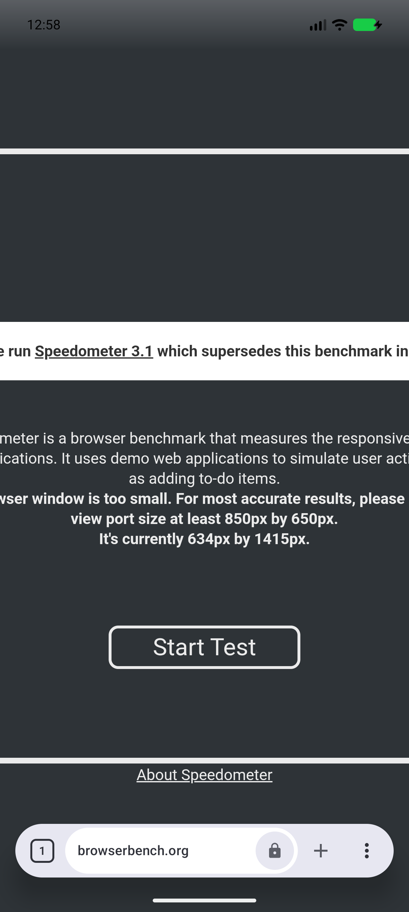
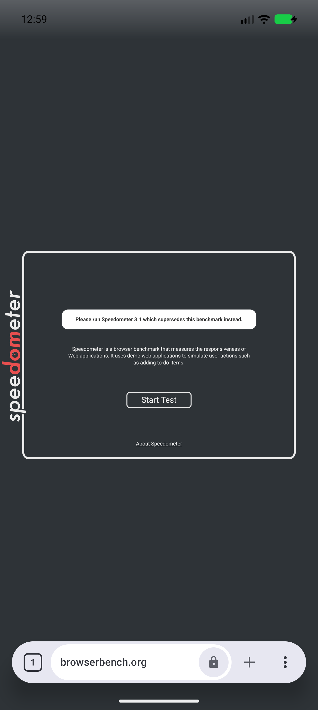
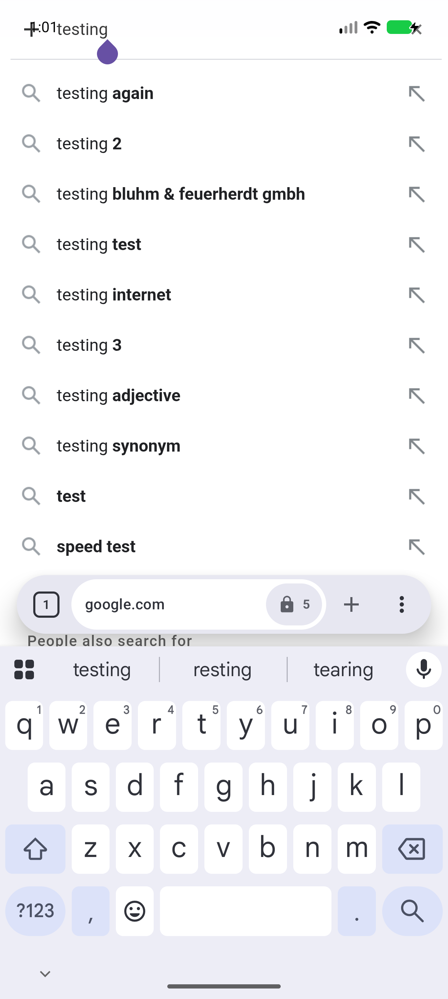
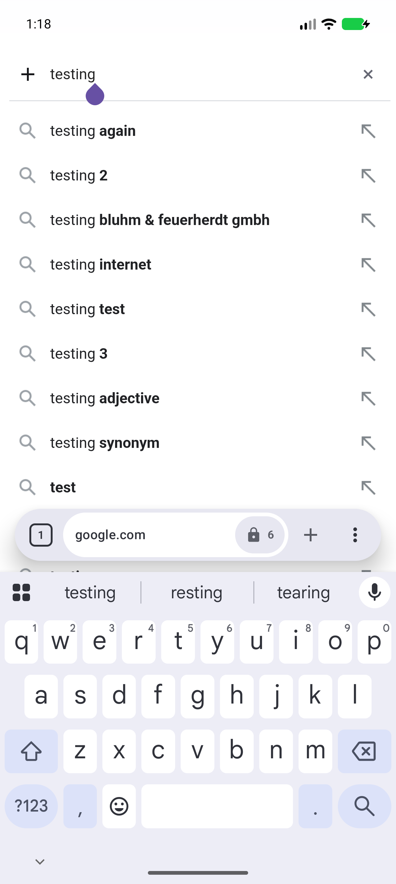
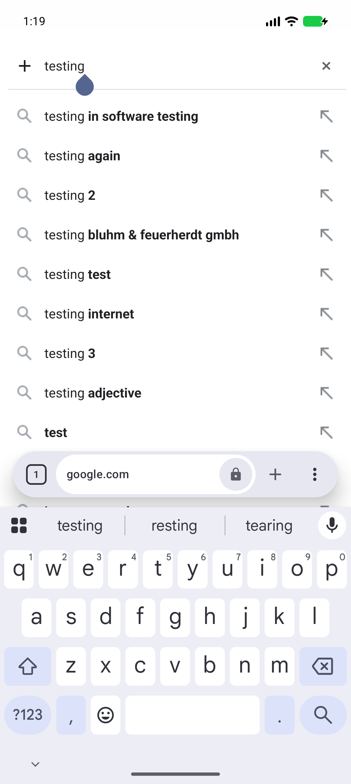

# Mobile viewport and focused search overlay audit (#210, #211)

Audit date: 2026-10-01. Baseline: `13b06769`; dedicated emulator `emulator-5586`.
This reproduces live websites and separate local fixtures. It does not claim an OPPO device reproduction.

| Environment | Value |
| --- | --- |
| Android | API 37 (Android 17), dedicated read-only AVD process |
| Window | 1280 × 2856 physical pixels, density 3, top safe inset 156 px / 52 CSS px |
| System WebView | Google System WebView 145.0.7632.218 |
| GeckoView | 157.0.20260924084938 |
| Build | FullDebug, default mobile identity, normal non-private tab |

## #210: legacy benchmark appears enlarged and clipped

The video caption names Speedometer 3.1, but its visible old-version notice also matches
[Speedometer 2.1](https://browserbench.org/Speedometer2.1/). Both live URLs were checked;
the original URL cannot be established from the video alone.

Speedometer 2.1 has no viewport meta tag. Its centered, absolutely positioned main panel is
842 CSS pixels wide (800 px content plus padding and borders). Candy's System WebView disabled
`useWideViewPort` and `loadWithOverviewMode` in mobile mode, including when returning from desktop
mode. That constrained the layout width and prevented the wide authored page from fitting.

| Live Speedometer 2.1 | Layout/client width | Visual width / scale | Panel left → right | Result |
| --- | ---: | ---: | ---: | --- |
| Candy System WebView, baseline | 426 | 426.67 / 1.0 | -207.67 → 634.33 | Enlarged, clipped |
| Raw Android WebView, wide viewport + overview | 980 | 980 / 0.43537 | 69 → 911 | Fits |
| Candy System WebView, production fix | 980 | 980 / 0.43537 | 69 → 911 | Fits |
| Candy GeckoView, unchanged | 980 | 980 / approximately 0.435 | 69 → 911 | Fits |

The defect belongs to Candy's System WebView configuration. The stock Android engine handles the
same page correctly with its wide-viewport and overview settings enabled. Gecko needs no change.
Candy now enables those settings for mobile and desktop; desktop user-agent and viewport rewriting
remain separate policies.

| Compatibility case | Verified behavior |
| --- | --- |
| Live [Speedometer 3.1](https://browserbench.org/Speedometer3.1/) | Authored `width=850` honored; client width 850, scale 0.50196 |
| Local no-meta centered 842 px panel | Fits in the wide viewport |
| Local `width=device-width, initial-scale=1` | Device width and scale 1 preserved |
| Responsive page with intentionally overflowing fixed-width content | Authored overflow remains; no forced content resizing |
| Desktop on → off with authored `initial-scale=0.75` | Mobile authored scale 0.75 honored |

| Before: System WebView | After: System WebView | Unchanged GeckoView |
| --- | --- | --- |
|  |  |  |

Android documents the relevant policies in
[`setUseWideViewPort`](https://developer.android.com/reference/android/webkit/WebSettings#setUseWideViewPort(boolean))
and [`setLoadWithOverviewMode`](https://developer.android.com/reference/android/webkit/WebSettings#setLoadWithOverviewMode(boolean)).

## #211: Google's focused page search editor overlaps the status bar

Live steps: open [Google search for testing](https://www.google.com/search?q=testing&hl=en),
reject the consent dialog, then tap the website's query field with a native touch event.
The resulting `#sbfbu=1&pi=testing` editor is Google's page overlay; Candy's address dock remains
at the bottom above the visible keyboard.

| Engine / mode | Focused editor top | Safe top | Result |
| --- | ---: | ---: | --- |
| System WebView, baseline default | 16 CSS px | 52 CSS px | Editor overlaps status icons |
| System WebView, baseline Force safe area | 16 CSS px inside renderer + 52 CSS px native margin | 52 CSS px | Safe workaround |
| System WebView, focused-container fix | 68 CSS px | 52 CSS px | Safe; no forced native margin |
| GeckoView, unchanged default | 204 physical px / 68 CSS px | 156 physical px / 52 CSS px | Already safe |

Google places the textarea inside a full-width, full-height fixed container at top zero.
The shared System WebView inset script excluded every viewport-sized container, so its existing
focused-container protection could not admit this editor. The fix admits only a fixed full-screen
container containing the currently focused text editor when the editor's original geometry crosses
the safe top. It uses the existing owned translation and panel-height constraints. Ownership-aware
geometry avoids adding offsets during repeated reconciliation. Backgrounds and non-editor controls
retain their previous geometry.

The fixed System WebView query stayed at client width 426, visual width 426.67 and scale 1.0.
Its container moved to top 52 CSS px; the textarea moved to 68 CSS px. The keyboard remained visible.
Gecko's native accessibility hierarchy independently confirmed a focused `android.widget.EditText`
with bounds `[162,204][1118,276]` physical pixels and text `testing`. Its screenshot was captured
without a Force safe area override. No Gecko code changed.

| Before: System WebView | After: System WebView | Unchanged GeckoView |
| --- | --- | --- |
|  |  |  |

## Verification

| Check | Result |
| --- | --- |
| FullDebug unit suite | 1637 passed, no failures/errors/skips |
| FossDebug unit suite | 1637 passed, no failures/errors/skips |
| Existing inset Node suite | 143 passed |
| New System WebView viewport instrumentation | Four passed: no meta, fixed meta width, responsive width/scale, desktop round trip |
| New full-viewport focused-editor instrumentation | Failed against old script (panel top 0 instead of 32 CSS px); passed after fix, including repeated reconciliation and hide/show |
| New full-viewport backdrop control | Passed; no owned translation or geometry change |
| Existing pre-focused search regression | Passed; retains one exact status inset |
| Live production-fix audit | System benchmark and focused Google editor passed; unchanged Gecko focused editor confirmed by screenshot/accessibility |

The old two-engine YouTube/Google IME fixture test was also run before edits. Its System Google
phase never focused the fixture editor after the preceding IME interaction; its Gecko YouTube
phase expected CSS inset delivery while the current engine activated semantic-header native
protection. These baseline fixture failures do not establish the live Google defect and were not
used to justify Gecko changes. They remain a separate fixture-maintenance concern.

Exploratory online instrumentation, waits and site-specific logging were kept outside the repository.
Committed regressions use local deterministic fixtures and engine/script domain names.
