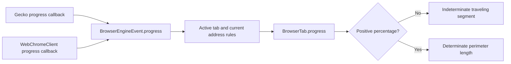

# Issue 215: address loading progress

| Question | Finding |
| --- | --- |
| Was the shared loading border already determinate? | Yes. Positive input selects a measured perimeter segment; zero/unknown input selects an explicit traveling segment. |
| Why did it keep circling? | The engine adapter migration dropped intermediate progress before it reached Android's `BrowserTab.progress`. The tab stayed at 0 until navigation committed. |
| Gecko callback | `GeckoSession.ProgressDelegate.onProgressChange` already updated raw session state, but progress-only changes were excluded from shared-event change detection. |
| System WebView callback | The adapter did not override `WebChromeClient.onProgressChanged`. |
| Shared boundary | `BrowserEngineEvent` had no progress field; Android's StateChanged handler did not consume progress/loading state. |
| Fix | Add optional progress, publish both adapters' percentages, and apply current-navigation loading rules in the controller. Preserve the existing border renderer and default rainbow. |
| User observation | Circling while no positive progress is available remains expected; no evidence proves this phase is DNS only. Rainbow colors also rotate while determinate length remains measured. |

## Loading path

## Verification

| Layer | Evidence |
| --- | --- |
| JVM adapter regression | Progress-only Gecko changes publish StateChanged events with 42 and 80; a closed adapter emits nothing further. |
| JVM loading rules | Clamp out-of-range values; preserve missing values; reject stale addresses, different tabs and late callbacks after stop. |
| Compose | Both Rainbow and Tonal expose 42% and indeterminate semantics; 0 → 42 → 80 → completion and partial interruption hide correctly. |
| Real engine integration | A local HTTP fixture gates main-document bytes and an uncached image response. Each engine must expose intermediate 1–99% while loading, finish at 100 after release, do the same on reload, and stop while the main document is delayed. |
| Isolation | Dedicated API 37 emulator, explicit `ANDROID_SERIAL=emulator-5582` and `adb -s emulator-5582`; each engine method uses a fresh instrumentation process. |

Engine percentages describe renderer progress, not elapsed time or downloaded bytes. Engines can
report 100 before every background operation ends and may finalize at 100 after cancellation; the
loading flag controls visibility. The regression captures immutable tab snapshots to avoid asserting
a transient intermediate percentage after a later callback has already arrived.
