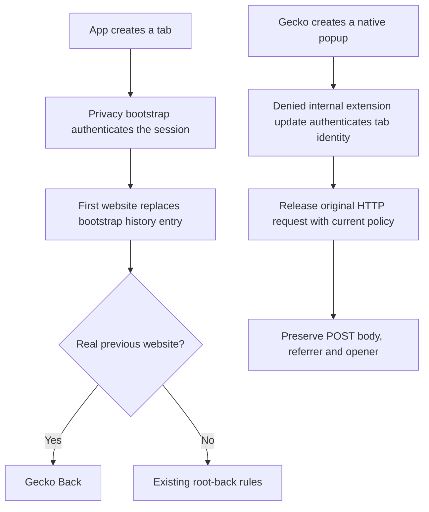

# Issue 221: Gecko navigation and popup regression audit

Issue: [Gecko website-not-found navigation failures](https://github.com/sk2andy/candy-browser/issues/221).

## Reproduction and cause

| Case | Previous behavior | Required behavior |
| --- | --- | --- |
| New tab → first website → Back | Native history retained the internal Privacy bootstrap document; Back navigated to that extension page | No real previous page: close the tab, return to its opener, or delegate to Android using the existing root-back rules |
| Bootstrap preceding a website in an old snapshot | Snapshot was accepted because only its current URL was checked | Reject the snapshot and reload the persisted website URL |
| Native `target="_blank"` | Loading the bootstrap document into Gecko's prepared child could replace its original navigation; its informational first URI was not routed through popup promotion | Bind the original child without document navigation and route its initial URI through popup policy |
| HTTP popup on an IP literal or localhost | Filter-domain canonicalization returned null, leaving a loaded child transient | Validate HTTP with `BrowserUriPolicy`; accept local hosts independently of filter-domain matching |

The first-page history failure was reproduced against the unchanged baseline APK: the native
history contained `[moz-extension://…/bootstrap.html?token=…, firstWebsite]` instead of
`[firstWebsite]`. The legacy-snapshot test also failed against that baseline.

## Decisions and boundaries

| Boundary | Enforcement |
| --- | --- |
| Bootstrap callbacks | Track the latest page start; internal completion/error callbacks cannot overwrite real-page state |
| Legacy history traversal | Skip bootstrap URLs while retaining native indices; reject direct traversal to a bootstrap entry |
| Native popup authentication | Require the current installed extension, its ID and origin, exact Gecko session, token, fresh challenge, safe native tab ID and acknowledged policy revision |
| Extension callback identity | Gecko may supply a new Java wrapper for the same installed extension. Compare registered ID and origin; retain exact session and current-installation checks |
| First native request | Wait for authenticated policy; timeout, tab removal and native disconnect cancel the request |
| Private browsing | Existing private/ephemeral persistence exclusions remain active; private popup test checks persistent tabs and history |
| External-app fallback | Test its Automatic GET path separately from the native popup path using AskEveryTime |
| Immediate script-created history | Assert that both native entries survive, then select index 0 explicitly. Gecko's normal `goBack()` uses its user-interaction protection and may skip untouched script-created entries; Candy retains that behavior |

## Verification

Verified on 2026-10-01 against baseline `17945b4e`, using GeckoView
`157.0.20260924084938` and dedicated API-35 emulators. Each agent used its own explicit serial;
no physical device was used.

| Check | Result |
| --- | --- |
| `testFullDebugUnitTest` | 1,695 passed; no failures, errors or skips |
| `testFossDebugUnitTest` | 1,695 passed; no failures, errors or skips |
| Native-session binding, privacy rules, privacy signals and animation Node suites | 22 passed |
| Full and Foss debug APK assembly | Passed |
| Full and Foss lint with legacy UAST | Passed |
| New first-page, manual Root Back, native GET/POST, private popup, immediate pushState, delayed repeated popup and bootstrap-snapshot device regressions | 11/11 passed |
| Existing Gecko session restore, selected Privacy-host and controller Root Back device regressions | 13/13 passed independently |
| Existing extension action/options/tab API fixture with fresh app and test data | Baseline 1/1 passed; fixed APK 1/1 passed |
| Existing UI Root Back class | 3/7 passed; four fixture failures independently reproduced |
| `git diff --check` | Passed |

The issue device checks were split across isolated processes after ADB transport interruption.
The final pushState and three delayed-popup cycles passed together. The extension fixture initially
failed with retained state after the popup suite; its matched fresh-data baseline/fixed comparison
passed. The underlying retained-state fixture failure was not diagnosed or changed in this fix.

The existing UI root-back class has four independently reproduced fixture failures: those tests
expect an overview after Back with one blank tab, while the unchanged root-back rule delegates
that case to Android and finishes the Activity. Its other three cases, all six controller cases,
all five Gecko restore cases, and both selected Privacy-host regressions passed independently.
The baseline APK was not used to rerun that UI class.

Default K2 lint hit an internal FIR-resolution failure in the existing
`GeckoSessionStateStoreInstrumentedTest.kt`. Verification uses the supported legacy UAST mode
with `-Dlint.useK2Uast=false`; this does not disable lint checks.
