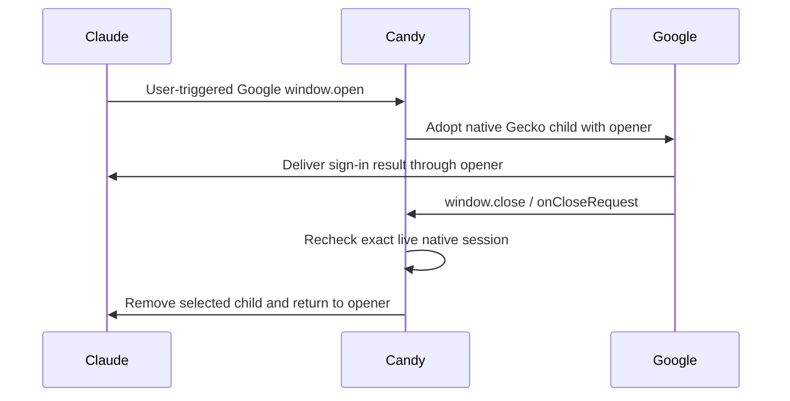

# Claude Google login popup completion

| Scope | Evidence |
| --- | --- |
| Issue | [#239](https://github.com/sk2andy/candy-browser/issues/239), split from [#235](https://github.com/sk2andy/candy-browser/issues/235) |
| Reporter recording | [Original login recording](https://github.com/user-attachments/assets/52e0fc50-1746-402a-af14-fbb75a6cd107) |
| Device reproduction | Pixel 11 Pro, Gecko, default Automatic external-app handling |
| Symptom | Google consent completes, then an empty `accounts.google.com/gsi/transform` page remains selected |

## Cause and correction

| Boundary | Before | After |
| --- | --- | --- |
| External-app routing | Automatic handling denies the Google new-window request. When no external app handles it, the browser fallback creates a fresh GET tab without the native opener channel. The live Google account chooser reports `window.opener === null`. | Known HTTPS Google identity popup requests stay in Gecko when user-triggered, as does provider navigation within the adopted native child. Existing popup admission rules still apply. The live account chooser reports a non-null opener. |
| Page-requested close | Gecko's `ContentDelegate.onCloseRequest` is not forwarded; a successful scripted popup cannot close its Candy tab. | Forward through runtime, session and adapter. Post to the controller's existing tab-removal path; only the exact adopted native child session may close. |
| Session lifetime | A tab ID alone cannot establish native-window provenance after renderer replacement. | Keep an in-memory tab-to-session identity map. Remove provenance on session close/replacement, crash, snooze, tab removal and controller destruction. Restored and manually opened tabs receive no grant. |
| Selection and privacy | Existing tab and persistence contracts own opener selection and private state. | Reuse those contracts: closing the selected child returns to its opener; background closure keeps the foreground tab. Private tabs and login pages remain absent from persistent tabs/history. |

Cookie compatibility remains separately consented. The routing correction does not change cookie policy or external routing for ordinary cross-site links.

## Verification

| Check | Result |
| --- | --- |
| Baseline OAuth popup regression | Fails as expected: opener receives success, but child remains selected |
| Live Pixel login with both corrections | Google child closes after consent; Claude navigates to `/new` and displays its signed-in account UI |
| Pixel app restart | Signed-in Claude state survives; temporary debugger socket is absent after configuration removal and restart |
| Claude account preferences | Updated terms/training-choice dialog left for the user; no account preference changed |
| FullDebug JVM suite | 1,766 tests, zero failures/errors/skips |
| FossDebug JVM suite | 1,766 tests, zero failures/errors/skips |
| FullDebug/FossDebug assembly | Passed |
| Android popup regressions | Eight tests passed on the session-owned API 36 emulator (`codex_issue239_root`); no physical device shared with another agent |
| FullDebug/FossDebug lint | Passed with `-Dlint.useK2Uast=false` |
| Focused code/style review | No actionable findings |

Android coverage includes real scripted normal/private completion, background close selection, manual-tab rejection, stale/recreated-session rejection, Google routing versus ordinary Automatic fallback, and existing POST/opener/history behavior. Background and replacement tests deliver the native callback explicitly; they do not depend on background JavaScript timer scheduling.

Live diagnosis used a temporary package-specific remote-debugging configuration for the isolated debug app. No authentication tokens, cookies, account identifiers or login-page captures are included in this audit.
